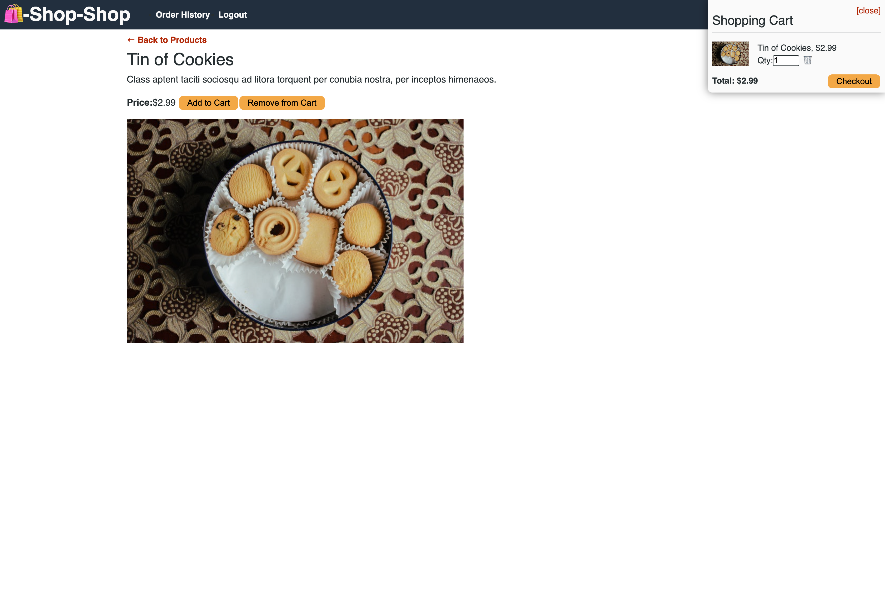
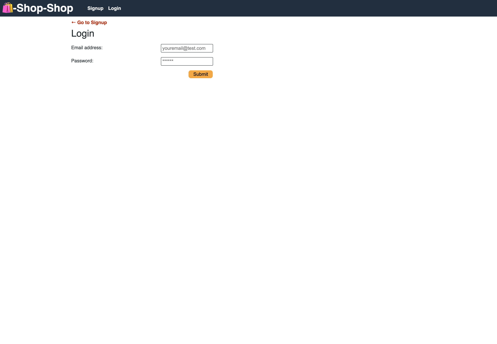
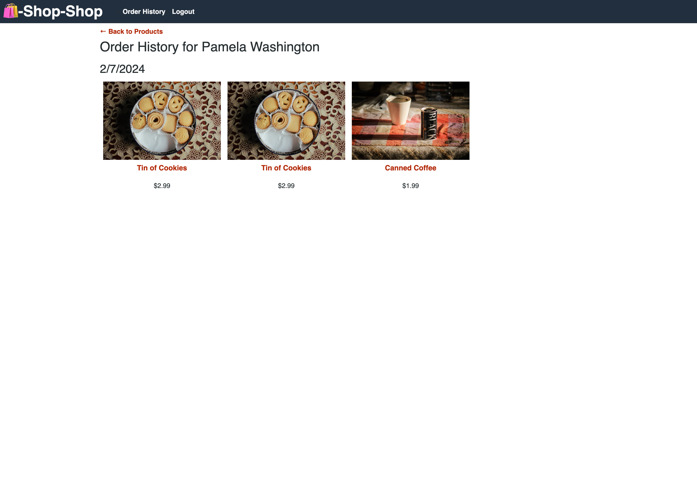

# 🛍️-Shop-Shop

## Deployed App

[🛍️-Shop-Shop](https://shop-shop-w4tp.onrender.com/)

## Description

DISCLAIMER: This is a mock e-commerce website. No products on this deployed website are actually for sale.

🛍️-Shop-Shop is an e-commerce platform built using React, Express, MongoDB, with Redux for global state management. Users can create an account and order a variety of products through a secure Stripe checkout page.

## Table of Contents
- [Requirements](#requirements)
- [Installation](#installation)
- [Usage](#usage)
- [License](#license)
- [Questions](#questions)
- [Screenshots](#screenshots)

## Requirements

Any Web Browser

## Installation

No installation needed.

## Usage

To begin browsing the available products, visit [🛍️-Shop-Shop](https://shop-shop-w4tp.onrender.com/) and you will be presented with a row of categories to click on to limit the products on the page based on what you are interested in. Create an account by clicking on `Signup` or click the `Login` link if you already have one. You can visit each product page to learn more about it and for buttons to add and remove from your cart.

You can click on the cart in the upper right part of the page to toggle the view of the cart, and be shown the items that are currently in it. You have the option to edit the quantity of each item.

When checking out, you will be taken to a Stripe checkout page where you can securely enter your payment information.

## License

This application is covered under MIT License.

Please refer to the LICENSE file in repo for more information.

## Questions

My GitHub profile: https://github.com/jaredbartos

If you have any further questions, please contact me through email.

jaredbartos@gmail.com

## Screenshots

